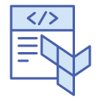
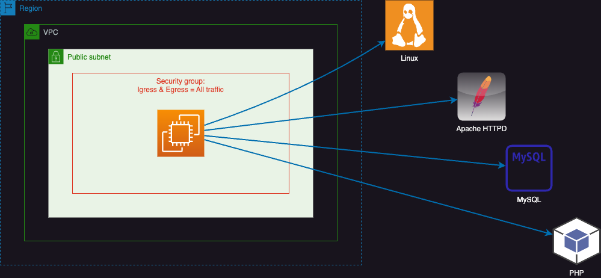

# About this project

This project can be used as reference by beginners to the 'infrastructure as code' (IaC) concept using Terraform and AWS cloud computing solutions, to setup a highly available (HA) and scalable (HS) cloud infrastructure in the shortest time possible.

 

# Scenario

Imagine you have a standard and very basic setup of a Wordpress CMS running on single AWS EC2 instance with the following attributes:

To be noted that the above scenario is based on a single availability zone (AZ)